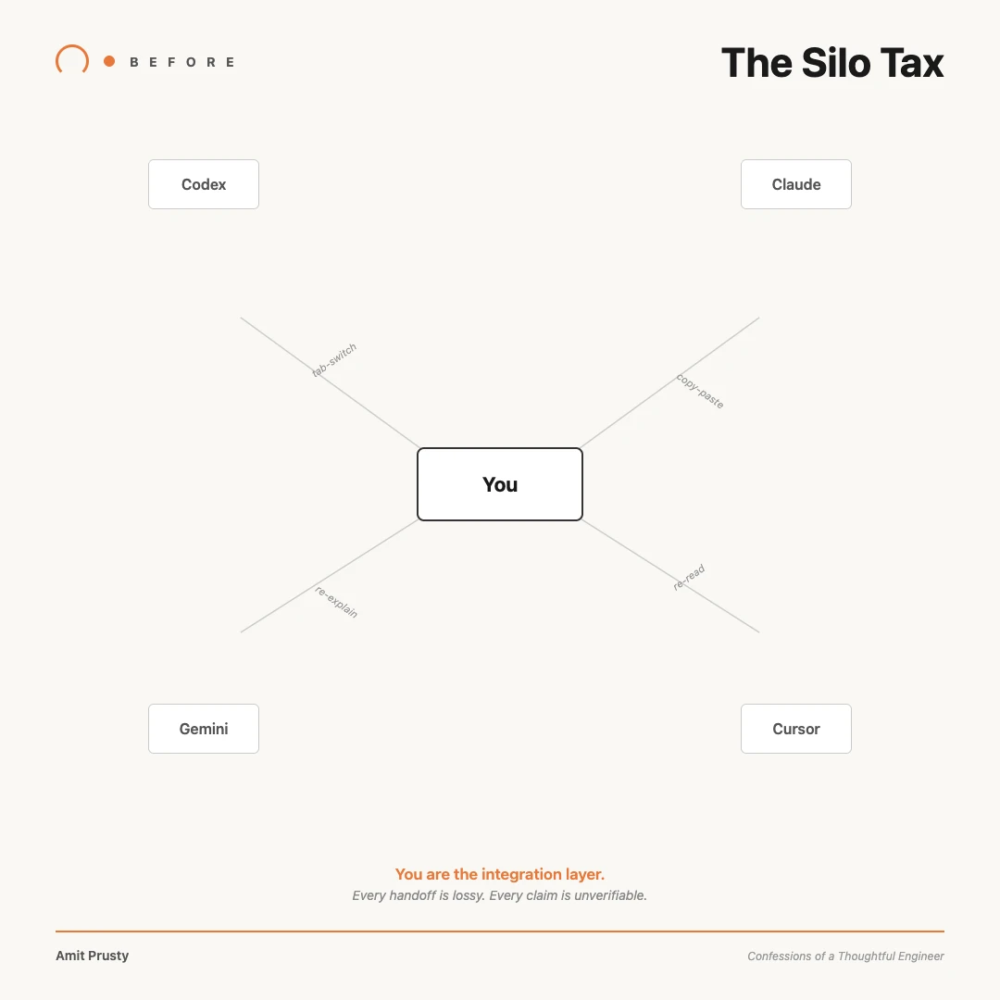
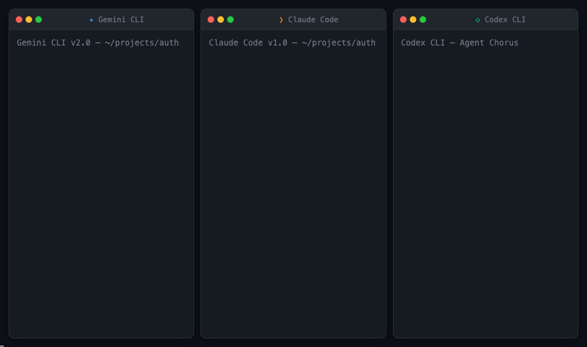
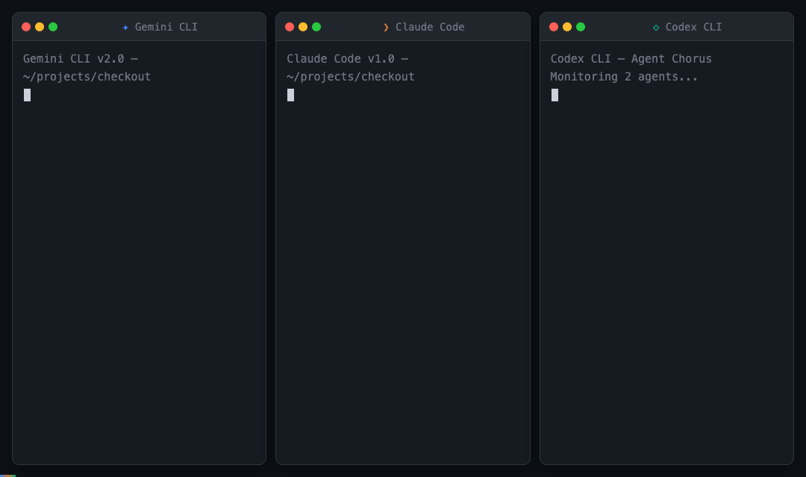
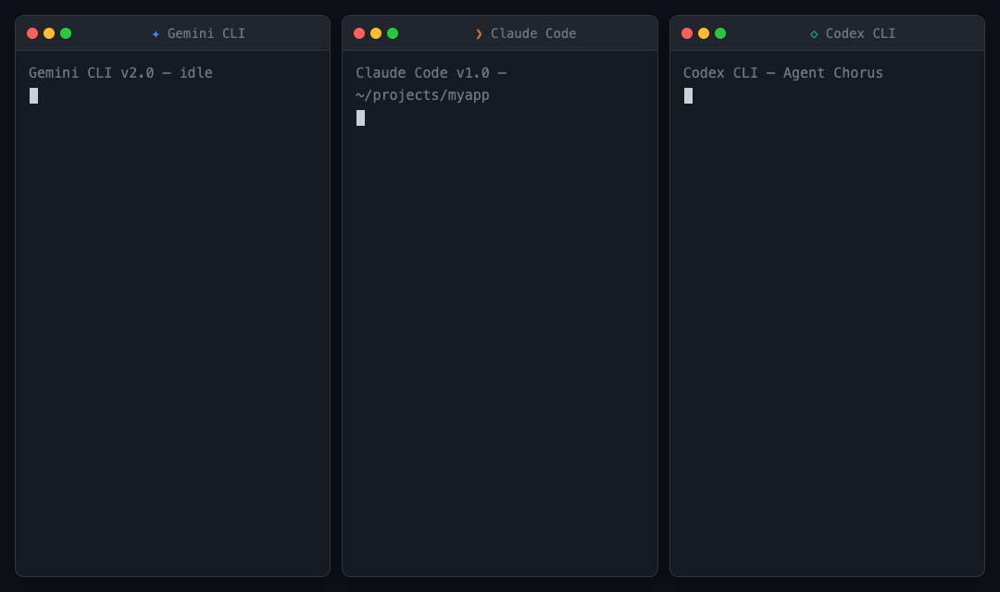
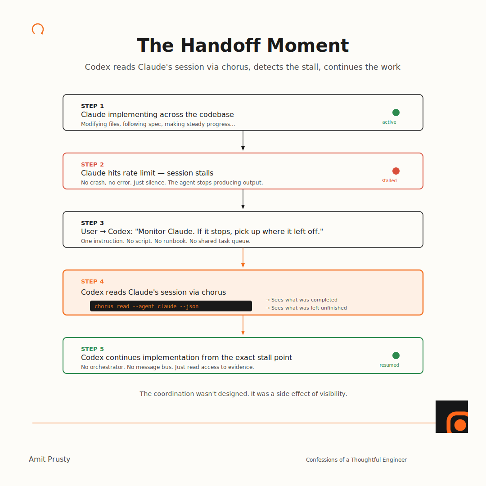
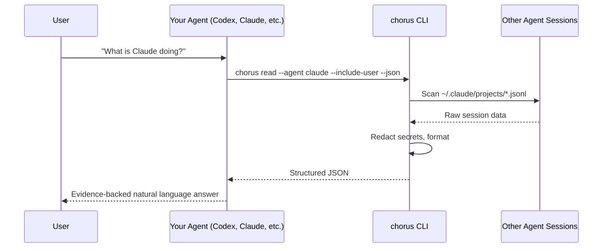
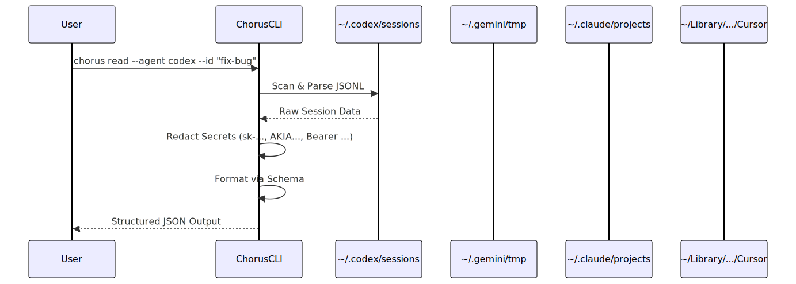
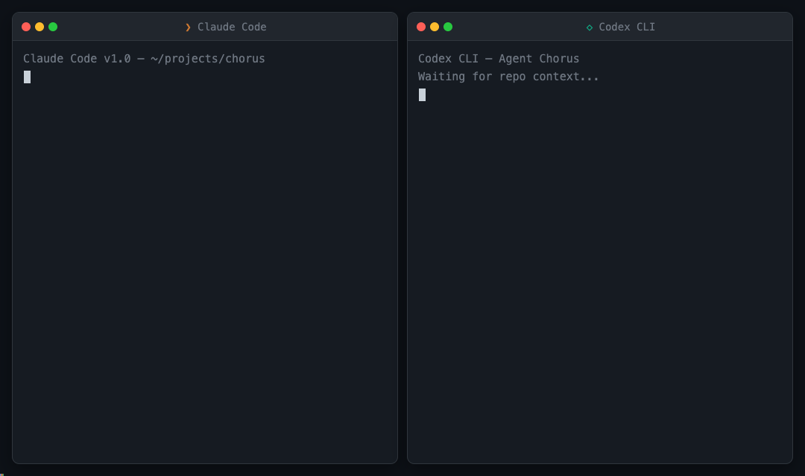
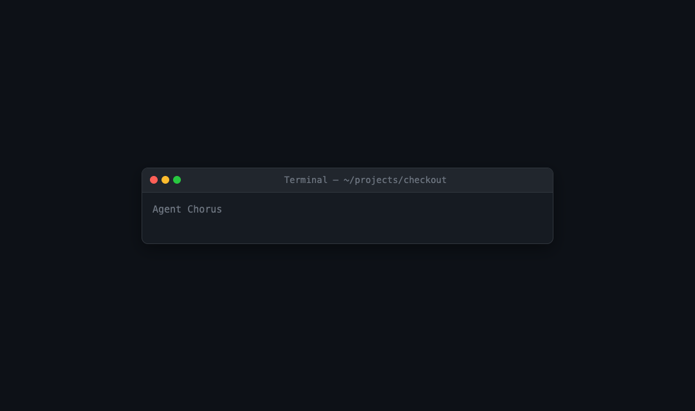

# Agent Chorus


[](https://github.com/cote-star/agent-chorus)

**Let your AI agents talk about each other.**

Ask one agent what another is doing, and get an evidence-backed answer. No copy-pasting, no tab-switching, no guessing.

> If you use 2+ AI coding agents (Codex, Claude, Gemini, Cursor), Chorus gives them shared visibility — no orchestrator required.



```bash
chorus read --agent claude --include-user --json
```

**Two problems, one tool:**
- **Silo Tax** — multi-agent workflows break when agents cannot verify each other's work. Chorus gives every agent read access to every other agent's session evidence.
- **Cold-Start Tax** — every new session re-reads the same repo from zero. A [Context Pack](#context-pack) gives agents instant repo understanding in 5 ordered docs.

## See It In Action

### The Handoff

Switch from Gemini to Claude mid-task. Claude picks up where Gemini left off.



### The Status Check

Three agents working on checkout. You ask Codex what the others are doing.



### What You Get Back

Every response is structured, source-tracked, and redacted:

```bash
chorus read --agent codex --include-user --json
```

```json
{
  "agent": "codex",
  "session_id": "session-abc123",
  "content": "USER:\nInvestigate the auth regression...\n---\nASSISTANT:\nI am tracing the auth middleware...",
  "timestamp": "2026-03-12T10:30:00Z",
  "message_count": 12,
  "source": "/home/user/.codex/sessions/2026/03/12/session-abc123.jsonl"
}
```

Source file, session ID, and timestamp on every response. Secrets auto-redacted before output.

Prefer markdown over JSON for human-facing output:

```bash
chorus read --agent codex --include-user --format markdown
```

Full JSON schema and field reference: [`docs/CLI_REFERENCE.md`](./docs/CLI_REFERENCE.md)

## Quick Start

### 1. Install

```bash
npm install -g agent-chorus    # requires Node >= 18
# or
cargo install agent-chorus     # requires Rust >= 1.74
```

### 2. Setup

```bash
chorus setup
chorus doctor # Check session paths, provider wiring, and updates
```

`setup` also appends `.agent-chorus/` to `.gitignore` automatically and, if the `claude` CLI is present, installs the Agent Chorus Claude Code plugin.

From zero to a working skill query in under a minute:



This wires skill triggers into your agent configs (`CLAUDE.md`, `GEMINI.md`, `AGENTS.md`) so agents know how to use chorus.

To cleanly reverse everything setup does (managed blocks, scaffolding, hooks):

```bash
chorus teardown           # reverse setup for this project
chorus teardown --global  # also remove ~/.cache/agent-chorus/
```

### 3. Ask

Tell any agent:

> "What is Claude doing?"
> "Compare Codex and Gemini outputs."
> "Pick up where Gemini left off."

The agent runs chorus commands behind the scenes and gives you an evidence-backed answer.

<details><summary>Session selection behavior</summary>

After `chorus setup`, provider instructions follow this behavior:

- If no session is specified, read the latest session in the current project.
- "past session" / "previous session" means one session before latest.
- "last N sessions" includes latest.
- "past N sessions" excludes latest (older N sessions).
- Ask for a session ID only if initial fetch fails or exact ID is explicitly requested.

</details>

## How It Works

1. **Ask naturally** - "What is Claude doing?" / "Did Gemini finish the API?"
2. **Agent runs chorus** - Your agent calls `chorus summary`, `chorus read`, `chorus timeline`, `chorus compare`, `chorus search`, `chorus diff`, `chorus send`, `chorus messages`, etc. behind the scenes.
3. **Evidence-backed answer** - Sources cited, divergences flagged, no hallucination.

**Tenets:**
- **Local-first** - reads directly from agent session logs on your machine. No data leaves.
- **Evidence-based** - every claim tracks to a specific source session file.
- **Privacy-focused** - automatically redacts API keys, tokens, and passwords.
- **Dual parity** - ships Node.js + Rust CLIs with identical output contracts.

## Real-World Recipes

### Quick Status Check

What is Claude working on right now? Get a structured digest — files touched, tools used, duration — without reading the full session. No LLM calls.

```bash
chorus summary --agent claude --cwd . --json
```

### Cross-Agent Timeline

See what every agent did across your project, in chronological order.

```bash
chorus timeline --cwd . --format markdown
```

### Tool Call Forensics

See exactly which files an agent read and edited — not just what it said.

```bash
chorus read --agent codex --tool-calls --json
```

### Handoff Recovery

Gemini crashed mid-task. Claude picks up where it left off, with full context.

```bash
chorus read --agent gemini --cwd . --include-user --json
```

### Cross-Agent Verification

Codex says it fixed the payment bug. Verify against Claude's analysis before deploying.

```bash
chorus compare --source codex --source claude --cwd . --json
```

### Security Audit

Check what secrets appeared in agent sessions and were redacted.

```bash
chorus read --agent claude --audit-redactions --json
```

### Agent Coordination

Tell Codex the auth module is ready — without switching tabs.

```bash
chorus send --from claude --to codex --message "auth module ready for review" --cwd .
chorus messages --agent codex --cwd . --json
```

## Supported Agents

Full multi-agent coverage. No other tool matches this breadth across 4 agents and 11 capabilities.

| Feature               | Codex | Gemini | Claude | Cursor |
| :-------------------- | :---: | :----: | :----: | :----: |
| **Read Content**      |  Yes  |  Yes   |  Yes   |  Yes   |
| **Session Summary***  |  Yes  |  Yes   |  Yes   |  Yes   |
| **Timeline***         |  Yes  |  Yes   |  Yes   |  Yes   |
| **Auto-Discovery**    |  Yes  |  Yes   |  Yes   |  Yes   |
| **CWD Scoping**       |  Yes  |   No   |  Yes   |   No   |
| **List Sessions**     |  Yes  |  Yes   |  Yes   |  Yes   |
| **Search**            |  Yes  |  Yes   |  Yes   |  Yes   |
| **Comparisons**       |  Yes  |  Yes   |  Yes   |  Yes   |
| **Session Diff**      |  Yes  |  Yes   |  Yes   |  Yes   |
| **Redaction Audit**   |  Yes  |  Yes   |  Yes   |  Yes   |
| **Messaging**         |  Yes  |  Yes   |  Yes   |  Yes   |

*\*New in v0.11.0. v0.11.0 features (Summary, Timeline, Tool Calls, Markdown output) are Node-only. Rust parity planned for v0.12.0.*

Both Node.js and Rust implementations pass identical conformance tests against shared fixtures for core commands.

## Key Capabilities

### Session Summary

Structured session digest — files touched, tools used, duration — without reading the full content. No LLM calls required.

```bash
chorus summary --agent claude --cwd . --json
```

### Cross-Agent Timeline

Chronological view interleaving sessions from multiple agents. See what happened across your entire project.

```bash
chorus timeline --cwd . --agent claude --agent codex --limit 5 --json
```

### Tool Call Visibility

Surface every `Read`, `Edit`, `Bash`, and `Write` call an agent made — not just the text it produced.

```bash
chorus read --agent codex --tool-calls --json
```

### Markdown Output

Render any read, summary, or timeline as formatted markdown instead of JSON. Useful for demos, docs, and human review.

```bash
chorus summary --agent claude --format markdown
```

### Session Diff

Compare two sessions from the same agent with line-level precision.

```bash
chorus diff --agent codex --from session-abc --to session-def --cwd . --json
```

### Redaction Audit Trail

See exactly what was redacted and why in any session read.

```bash
chorus read --agent claude --audit-redactions --json
```

### Agent-to-Agent Messaging

Agents leave messages for each other through a local JSONL queue.

```bash
chorus send --from claude --to codex --message "auth module ready for review" --cwd .
```

### Relevance Introspection

Inspect and test the agent-context filtering patterns that decide which files matter.

```bash
chorus relevance --list --cwd .              # Show current include/exclude patterns
chorus relevance --test src/main.rs --cwd .  # Test if a file matches
```

Full flag reference and JSON output schemas: [`docs/CLI_REFERENCE.md`](./docs/CLI_REFERENCE.md)

## How It Compares

| | agent-chorus | CrewAI / AutoGen | ccswarm / claude-squad |
| :--- | :---: | :---: | :---: |
| **Approach** | Read-only evidence layer | Full orchestration framework | Parallel agent spawning |
| **Install** | `npm i -g agent-chorus` or `cargo install` | pip + ecosystem | git clone |
| **Agents** | Codex, Claude, Gemini, Cursor | Provider-specific | Usually Claude-only |
| **Dependencies** | Zero npm prod deps | Heavy Python/TS stack | Moderate |
| **Privacy** | Local-first, auto-redaction | Cloud-optional | Varies |
| **Session summaries** | Built-in (no LLM) | None | None |
| **Cross-agent timeline** | Built-in | None | None |
| **Markdown output** | Built-in | N/A | None |
| **Cold-start solution** | Context Pack (5-doc briefing) | None | None |
| **Language** | Node.js + Rust (conformance-tested) | Python or TypeScript | Single language |
| **Agent messaging** | Built-in JSONL queue | Framework-specific | None |
| **Philosophy** | Visibility first, orchestration optional | Orchestration first | Task spawning |

## Architecture

Chorus sits between your agent and other agents' session logs. The workflow is evidence-first: one agent reads another agent's session evidence and continues with a local decision, without a central control plane.





<details><summary>Diagram not rendering? View as image</summary>



</details>

### Current Boundaries

- No orchestration control plane: no task router, scheduler, or work queues.
- No autonomous agent chaining by default; handoffs are human-directed.
- No live synchronization stream; reads are snapshot-based from local session logs.

## Context Pack

A context pack is an agent-first, token-efficient repo briefing for end-to-end understanding tasks.
Instead of re-reading the full repository on every request, agents start from `.agent-context/current/` and open project files only when needed.
This works the same for private repositories: the pack is local-first and does not require making your code public.

- `5` ordered docs + `manifest.json` (compact index, not a repo rewrite).
- Deterministic read order: `00` -> `10` -> `20` -> `30` -> `40`.
- Agent-maintained in the intended workflow; verify with `chorus agent-context verify`.
- CI gate available: `chorus agent-context verify --ci` for PR freshness checks.
- Local recovery snapshots with rollback support.

```bash
# Recommended workflow:
chorus agent-context init    # Creates .agent-context/current/ with templates
# ...agent fills in <!-- AGENT: ... --> sections...
chorus agent-context seal    # Validates content and locks the pack

# Manual rebuild (backward-compatible wrapper)
chorus agent-context build

# Install pre-push hook (advisory-only check on main push)
chorus agent-context install-hooks
```

Ask your agent explicitly:

> "Understand this repo end-to-end using the context pack first, then deep dive only where needed."




CI gate available: `chorus agent-context verify --ci` exits non-zero if the pack is stale or corrupt — wire it into your PR checks.

Full agent-context internals, sync policy, layered model, and enforcement details: [`AGENT_CONTEXT.md`](./AGENT_CONTEXT.md)

## Easter Egg

`chorus trash-talk` roasts your agents based on their session content.



## Roadmap

- **Rust parity for v0.11.0** - summary, timeline, tool-calls, and markdown output in the Rust CLI (planned v0.12.0).
- **Context Pack customization** - user-defined doc structure, custom sections, team templates.
- **Windows installation** - native Windows support (currently macOS/Linux).
- **Cross-agent context sharing** - agents share context snippets (still read-only, still local).

## Go Deeper

| If you need... | Go here |
| :--- | :--- |
| Full command syntax and JSON outputs | [`docs/CLI_REFERENCE.md`](./docs/CLI_REFERENCE.md) |
| Agent-context internals and policy details | [`AGENT_CONTEXT.md`](./AGENT_CONTEXT.md) |
| Protocol and schema contract details | [`PROTOCOL.md`](./PROTOCOL.md) |
| Contributing or extending the codebase | [`docs/DEVELOPMENT.md`](./docs/DEVELOPMENT.md) / [`CONTRIBUTING.md`](./CONTRIBUTING.md) |
| Release-level changes and upgrade notes | [`RELEASE_NOTES.md`](./RELEASE_NOTES.md) |

---

Every agent session is evidence. Chorus makes it readable.

Found a bug or have a feature idea? [Open an issue](https://github.com/cote-star/agent-chorus/issues). Ready to contribute? See [`CONTRIBUTING.md`](./CONTRIBUTING.md).

[](https://star-history.com/#cote-star/agent-chorus&Date)
